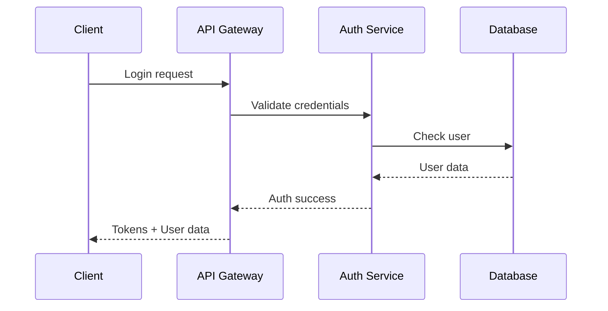

# Backend Architecture

## Service Architecture

### Serverless Architecture

#### Function Organization

```
apps/api/src/
├── server/
│   ├── routers/             # tRPC routers
│   ├── services/            # Business logic services
│   ├── db/                  # Database layer
│   ├── middleware/          # API middleware
│   └── utils/               # Utility functions
├── jobs/                    # Background jobs
└── api/
    └── trpc/
```

## Database Architecture

### Data Access Layer

```typescript
// Prisma client with tenant context
export class TransactionRepository {
  constructor(
    private db: PrismaClient,
    private context: ShopContext,
  ) {}

  async create(data: Prisma.TransactionCreateInput) {
    const shopId = this.context.getShopId();
    return this.db.transaction.create({
      data: { ...data, shopId },
    });
  }
}
```

## Authentication and Authorization

### Auth Flow



---
