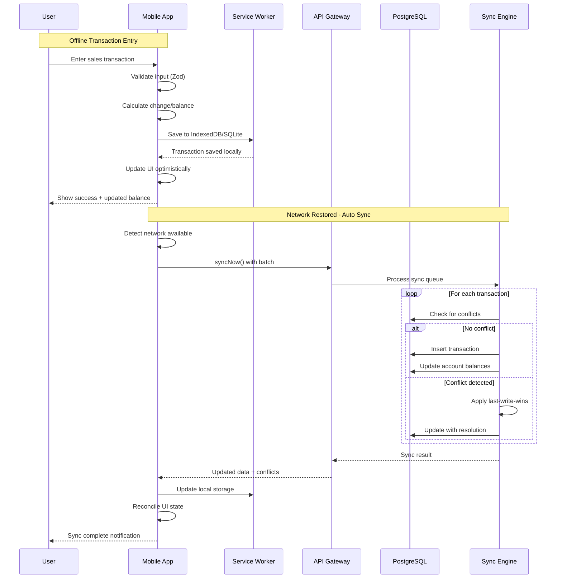
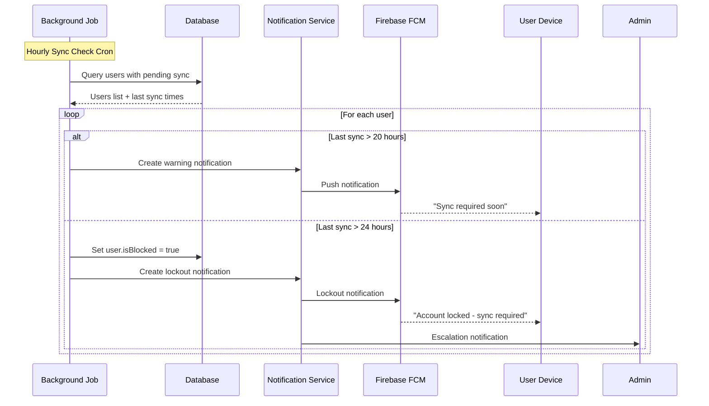

# Core Workflows

Critical system workflows illustrating component interactions for key user journeys.

## Daily Transaction Entry with Offline Support

```mermaid
sequenceDiagram
    participant U as User
    participant M as Mobile App
    participant SW as Service Worker
    participant API as API Gateway
    participant DB as PostgreSQL
    participant S as Sync Engine

    Note over U,M: Offline Transaction Entry
    U->>M: Enter sales transaction
    M->>M: Validate input (Zod)
    M->>M: Calculate change/balance
    M->>SW: Save to IndexedDB/SQLite
    SW-->>M: Transaction saved locally
    M->>M: Update UI optimistically
    M-->>U: Show success + updated balance

    Note over M,S: Network Restored - Auto Sync
    M->>M: Detect network available
    M->>API: syncNow() with batch
    API->>S: Process sync queue

    loop For each transaction
        S->>DB: Check for conflicts
        alt No conflict
            S->>DB: Insert transaction
            S->>DB: Update account balances
        else Conflict detected
            S->>S: Apply last-write-wins
            S->>DB: Update with resolution
        end
    end

    S-->>API: Sync result
    API-->>M: Updated data + conflicts
    M->>SW: Update local storage
    M->>M: Reconcile UI state
    M-->>U: Sync complete notification
```

## 24-Hour Mandatory Sync Enforcement

```mermaid
sequenceDiagram
    participant BG as Background Job
    participant DB as Database
    participant NS as Notification Service
    participant FCM as Firebase FCM
    participant U as User Device
    participant Admin as Admin

    Note over BG: Hourly Sync Check Cron
    BG->>DB: Query users with pending sync
    DB-->>BG: Users list + last sync times

    loop For each user
        alt Last sync > 20 hours
            BG->>NS: Create warning notification
            NS->>FCM: Push notification
            FCM-->>U: "Sync required soon"
        else Last sync > 24 hours
            BG->>DB: Set user.isBlocked = true
            BG->>NS: Create lockout notification
            NS->>FCM: Lockout notification
            FCM-->>U: "Account locked - sync required"
            NS->>Admin: Escalation notification
        end
    end
```

---
