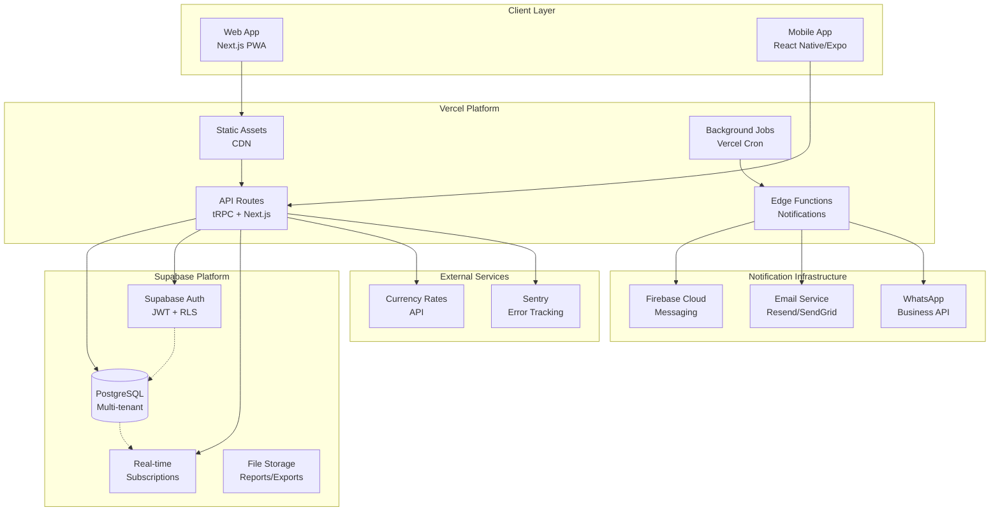

# High Level Architecture

## Technical Summary

The Multi-Shop Spare Parts Accounting App employs a **T3 Stack monolithic architecture** with **serverless functions**, featuring a **unified Next.js application** serving both web and mobile clients through tRPC APIs. The system implements **offline-first architecture** with mandatory 24-hour sync cycles, **multi-tenant data isolation** at the database level, and a **comprehensive notifications system** handling real-time alerts, scheduled reminders, and escalation workflows. **Arabic-first RTL design** with bilingual support drives the frontend experience, while **PostgreSQL with Prisma** provides ACID-compliant financial transaction storage deployed on **Vercel with Supabase/Vercel Postgres**.

## Platform and Infrastructure Choice

**Recommended Platform:** **Vercel + Supabase**

**Analysis of Options:**

**Option 1: Vercel + Supabase** ⭐ **RECOMMENDED**
- ✅ **Pros:** Seamless T3 Stack integration, built-in auth, real-time subscriptions, managed PostgreSQL, excellent DX
- ✅ **Notifications:** Built-in real-time features, webhook support, edge functions for background jobs
- ✅ **Cost:** Generous free tiers, predictable scaling costs
- ❌ **Cons:** Vendor lock-in, less control over infrastructure

**Option 2: AWS Full Stack**
- ✅ **Pros:** Enterprise scale, complete control, extensive services
- ❌ **Cons:** Complex setup, higher costs, longer development time
- ❌ **Notifications:** Requires SNS/SES setup complexity

**Option 3: Vercel + Vercel Postgres**
- ✅ **Pros:** Single vendor simplicity, tight integration
- ❌ **Cons:** Newer service, less features than Supabase

**Final Choice:** **Vercel + Supabase**

**Platform:** Vercel + Supabase
**Key Services:**
- Vercel (Frontend hosting, API routes, edge functions)
- Supabase (PostgreSQL, Auth, Real-time subscriptions, Storage)
- Firebase Cloud Messaging (Mobile push notifications)
- Resend/SendGrid (Email notifications)

**Deployment Host and Regions:** Vercel Edge Network (Global), Supabase EU/US regions

## Repository Structure

**Structure:** T3 Stack Monorepo with mobile integration
**Monorepo Tool:** Turborepo (included in T3 Stack)
**Package Organization:** Apps (web/mobile) + Shared packages (types, UI, utilities)

## High Level Architecture Diagram

## Architectural Patterns

- **T3 Stack Architecture:** Unified TypeScript monolith with tRPC for type-safe APIs - _Rationale:_ Eliminates API layer complexity while maintaining type safety across full stack
- **Offline-First Pattern:** Local-first data with sync queues and conflict resolution - _Rationale:_ Critical for shop floor operations with unreliable internet connectivity
- **Multi-tenant with RLS:** Row-level security for complete data isolation between shops - _Rationale:_ Ensures secure data separation without application-layer complexity
- **Event-Driven Notifications:** Background job triggers for scheduled and real-time alerts - _Rationale:_ Enables reliable delivery of critical business notifications
- **Component-Based UI:** Reusable React components with Arabic/RTL support - _Rationale:_ Maintainability and consistency across bilingual interfaces
- **Repository Pattern:** Abstract data access through Prisma with business logic separation - _Rationale:_ Enables testing and future database migration flexibility
- **Optimistic UI Updates:** Immediate UI feedback with rollback on sync failure - _Rationale:_ Maintains responsive UX even during offline operations

---
